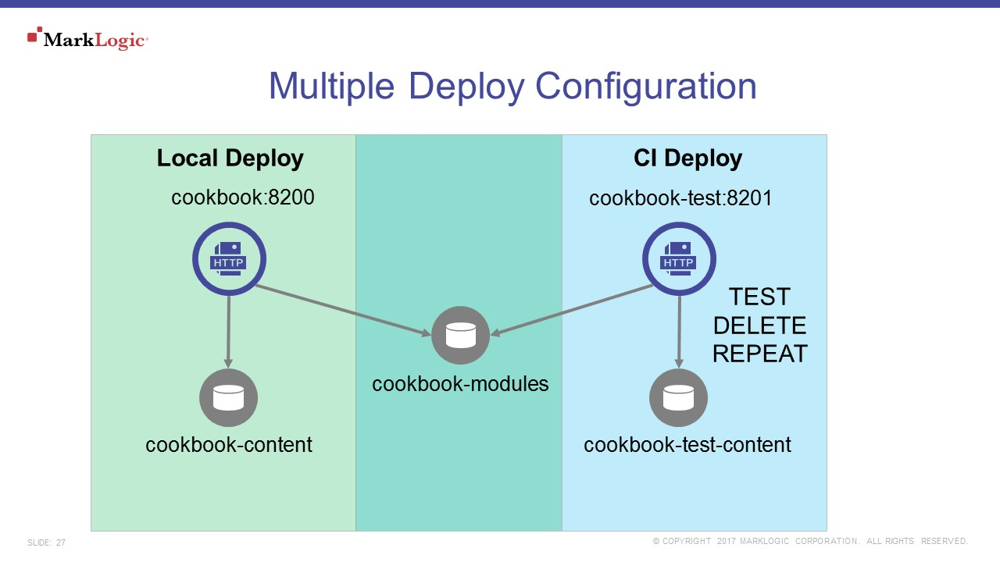

# Run Automated Testing
Automated testing is the best way to reduce technical risk on a software project.  On a MarkLogic project, REST extensions, search options, ingest, and transform functionality needs to be tested upon each deploy.  Giving Java developers a way to run continuous integration (CI) tests in a local environment reduces the risk of introducing defects when features merge into a code baseline.  The problem is running local CI tests and using the same deploy for an attached resource for a user interface will cause conflicts.  The recommendation is for developers to run two deploys, a local deploy that would serve as a backing resource to a user interface on port 8200, and a second deploy dedicated for CI testing running on port 8201, as depicted in Figure 3. 
 

## MarkLogic Version
MarkLogic 8.0-4+

## References
 * [ml-junit](https://github.com/rjrudin/ml-junit)
 * [JUnit](http://junit.org/junit4/)
 * [Gradle Java Plugin](https://docs.gradle.org/current/userguide/java_plugin.html)
   * [Test](https://docs.gradle.org/current/userguide/java_plugin.html#sec:java_test) 
 * [ml-gradle recipe](https://github.com/marklogic-community/ml-gradle/wiki/Setup-Test-Resources)

## Run MarkLogic JUnit Tests
 * Java source code used for testing resides in src/test/java
 * Store sample data for testing in src/test/resources
 * In gradle.properties make sure that the variable mlTestPort is set to a port value.  If it is zero, the CI Deploy will not get generated.
 * Run the following gradle command to execute the tests
  
        gradle test

 * Test report found under $PROJECT_ROOT/build/reports/tests/test
