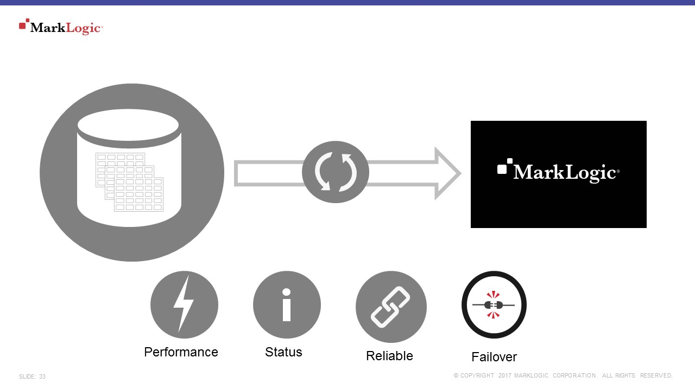

# Load Data from a Relational Database
There are many ways to load data from a relational database (RDB) into MarkLogic.   Ideally, a job is performant, provides graceful failover (possibly with a restart capability), provides real time status, and reliably executes long running jobs.  The Data Movement Software Development Kit (SDK) is a package in the Java Client API intended for manipulating large numbers of documents and/or metadata through an asynchronous interface that efficiently distributes workload across a MarkLogic cluster. This framework is best suited for long running operations and/or those that manipulate large numbers of documents.

## MarkLogic Version
MarkLogic 9.0-1+

## Source Code

[MigrateSqlDatabaseJob](https://github.com/sastafford/cookbook/blob/master/src/main/java/com/marklogic/cookbook/MigrateSqlDatabaseJob.java)

## References
 * [Data Movement SDK](http://docs.marklogic.com/guide/java/data-movement)
 * [Gradle – Application Plugin](https://docs.gradle.org/current/userguide/application_plugin.html)
 * [HyperSQL](http://hsqldb.org/) (for testing)  
 * (Optional) [Spring Batch](http://docs.spring.io/spring-batch/trunk/reference/html/) 
   * [MarkLogic Spring Batch](https://github.com/marklogic-community/marklogic-spring-batch) 
 * [Sample RDBMS Application](https://github.com/rjrudin/ml-migration-starter)

